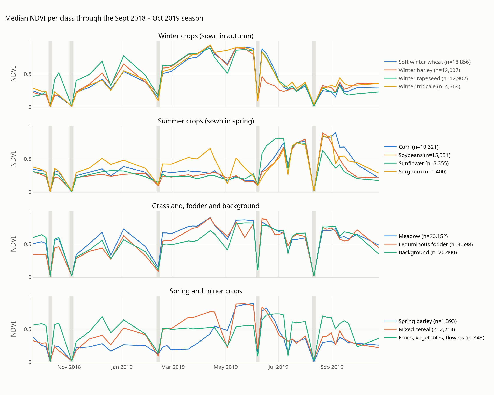
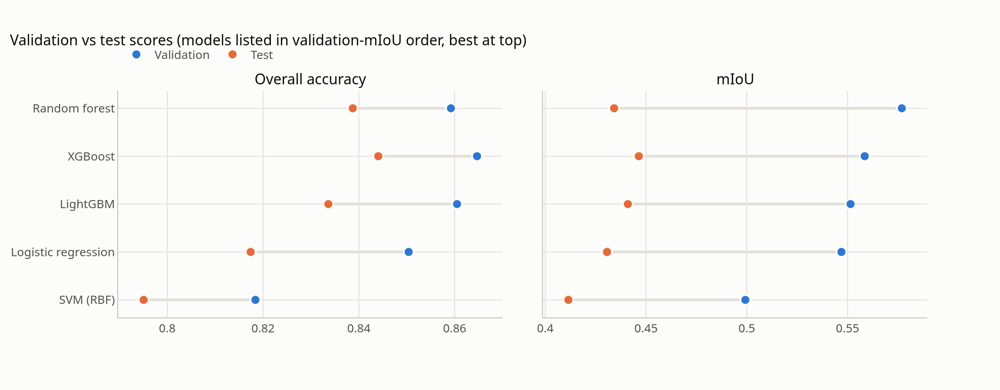
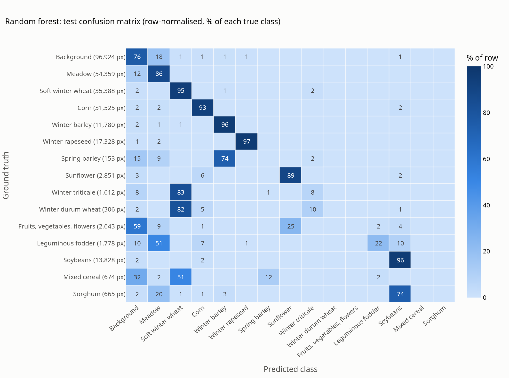
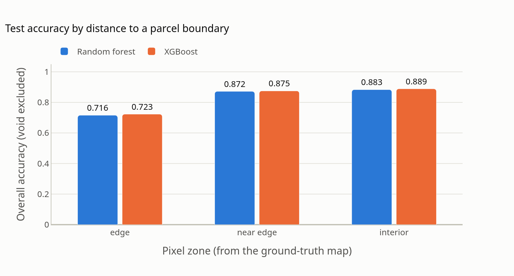
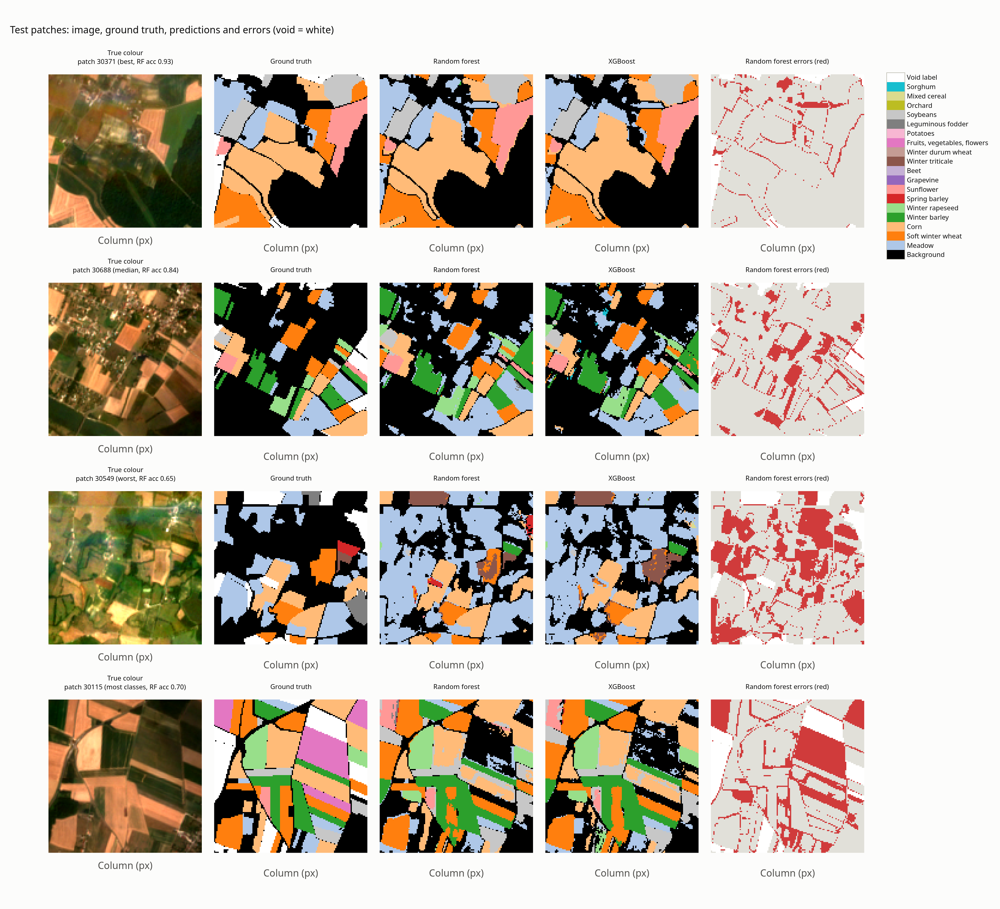
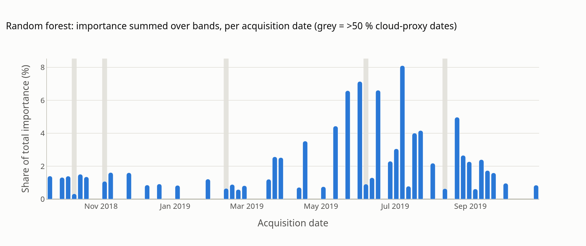

# Crop-type classification on a PASTIS Sentinel-2 subset: report

## 1. Summary

Six classical classifiers were trained to label every pixel of 128 × 128 Sentinel-2 patches with one of the PASTIS
crop classes, using each pixel's full 46-date time series as input. On 18 held-out test patches:

| Model | Test OA | Test macro-F1 | Test mIoU | Test kappa | Validation mIoU |
|---|---|---|---|---|---|
| **XGBoost** | **0.844** | **0.504** | **0.446** | **0.805** | 0.559 |
| LightGBM | 0.834 | 0.501 | 0.441 | 0.792 | 0.551 |
| Random forest (pre-selected) | 0.839 | 0.494 | 0.434 | 0.798 | **0.577** |
| Logistic regression | 0.817 | 0.494 | 0.431 | 0.773 | 0.547 |
| SVM (RBF) | 0.795 | 0.479 | 0.411 | 0.747 | 0.499 |
| Majority class (baseline) | 0.357 | 0.035 | 0.024 | 0.000 | 0.022 |

- The **seven major classes** (soft winter wheat, corn, winter rapeseed, soybeans, winter barley, sunflower, meadow)
  are classified reliably: test F1 0.78–0.96.
- **Minority classes are not learned.** Each collapses into its closest large neighbour, for example triticale and
  durum wheat into soft winter wheat. With all 15 test classes weighted equally, this caps mIoU at ~0.45 while OA
  stays at ~0.84.
- **Parcel-edge pixels are the main error source.** They are 25 % of the labelled pixels but carry 45 % of the errors
  (accuracy 0.72 vs 0.88 inside fields).
- The random forest was fixed as the primary model from validation mIoU before any test prediction was made. On test,
  XGBoost is slightly but consistently better (Section 5.5).

## 2. Data and area of interest

- **102 patches**, each 128 × 128 px at 10 m (1.28 × 1.28 km). Each has **10 bands × 46 acquisitions**, and the 46
  dates are identical for every patch (20 Sep 2018 – 25 Oct 2019). The pixel values are surface reflectance × 10,000.
  Only 0.1 % of values are negative (B11) and 0.2–0.4 % exceed 10,000, the signature of clouds.
- **20 label ids:** background (0), 18 crop classes and void (19). The subset holds 19 of them; beet is absent.
  Background (30 %), meadow (18 %), soft winter wheat (12 %) and corn (12 %) dominate. Grapevine, potatoes and orchard
  occur in one patch each.
- **Location.** All patches lie in one Sentinel-2 tile (T31TFM), in a ~33 × 36 km area of the Bresse plain east of the
  Saône, between Chalon-sur-Saône and Louhans (from the OpenStreetMap/CARTO basemap). They are a sparse sample:
  neighbouring patches are typically one patch width (1.28 km) apart.
- **Landscape.** Fields are small: on average 49 annotated parcels per patch and ~2.4 ha per parcel. About 30 % of
  each patch is non-agricultural background (woodland, hedges, villages). Grassland plus maize, wheat and oilseeds
  suggests mixed livestock–arable farming. This is an inference from the class mix and imagery, not from external
  statistics.
- **Clouds.** No cloud mask is provided. A brightness proxy (blue reflectance > 0.20) flags only 28 of the 46 dates as
  essentially clear. Five are more than half contaminated, including 7 Jun and 11 Aug 2019, both in the growing
  season. The acquisition date explains 72 % of the proxy's variance, so cloud cover is mostly AOI-wide weather. The
  proxy misses cloud shadows, so real contamination is higher.

**The crop calendar is the key signal.** Autumn-sown cereals and rapeseed peak in April–June and are harvested in
late June/July; winter barley ripens first. Rapeseed is already green in autumn. Summer crops (corn, soybeans,
sunflower) green up only from June and peak in July–September. Meadow and background stay green all year. Soft wheat
and triticale have near-identical curves, and so do meadow and background. These two pairs are where the confusions
appear later.

## 3. Approach

**Why pixel-level classical machine learning.** The labels are a semantic layer without parcel instances, so
per-pixel classification is the direct formulation. The phenology plot shows the discriminative information is
temporal, which a per-pixel time-series vector captures well. The development machine had 8 CPU cores, no GPU and
~1.3 GB of free RAM, which rules out training segmentation networks locally. The brief also favours a well-reasoned
baseline over an unnecessarily complex model.

**Features (552 per pixel).** Reflectance of the 10 bands on all 46 dates, clipped to [0, 1], plus NDVI and NDMI per
date. Per-date features are directly comparable across patches only because all patches share one acquisition
calendar. Clouds are not masked; the models are expected to down-weight cloudy dates, and they do (Section 5.4).

**Split (leakage-aware).** Whole patches are assigned to splits, never pixels, so no parcel appears in two splits. The
split uses the official PASTIS folds: train = folds 1–3 (66 patches), validation = fold 4, test = fold 5 (18
patches each). Which fold became validation and which test was chosen by an explicit rule. It maximises the classes
seen in training (18 of 19), then the classes evaluable in both held-out splits, then minimises their class-
distribution divergence from the whole dataset. No held-out patch touches a training patch (minimum gap 1.28 km).

**Training sample and class imbalance.** The 66 training patches hold ~1.0 M labelled pixels. Pixels within a field
are near-duplicates, and the full feature matrix would be 2.2 GB. So each class contributes at most 15,000 randomly
drawn pixels (141,831 in total, rare classes kept in full). On top of that cap, sample weights ∝ class
frequency−0.5 give the rarest class ~14× the weight of a capped class, without the extreme weights of full
balancing. Void pixels are excluded everywhere.

**Models and selection.** Majority baseline, logistic regression, RBF SVM (on 48 PCA components), random forest,
XGBoost and LightGBM. Small grids (logistic regression C; SVM C × γ; LightGBM leaves × min leaf size) and GBDT early
stopping use only a class-capped validation subsample. Forest size was set by the RAM budget. Early stopping monitors
classification error, not log-loss: log-loss started rising after ~30–55 rounds because of confident mistakes on
classes no model learns, and stopping on it cost XGBoost 0.011 mIoU. All settings are in `configs/config.yaml`;
hyperparameter tables are in the notebook.

## 4. Results

- **Overall accuracy transfers; mIoU does not.** From validation to test, OA drops by 0.01–0.04, but mIoU drops by
  ~0.12 for *every* model. This is a property of fold 5, not model overfitting (Section 5.2).
- **Four models form a leading group** (test mIoU 0.431–0.446, OA 0.817–0.844). The SVM is clearly worse, and every
  model is far above the majority baseline, which alone reaches 36 % OA.

Test F1 per class for the pre-selected random forest and the best model on test:

| Class (test pixels) | Random forest | XGBoost | | Class (test pixels) | Random forest | XGBoost |
|---|---|---|---|---|---|---|
| Winter rapeseed (17,328) | 0.95 | 0.96 | | Background (96,924) | 0.81 | 0.82 |
| Corn (31,525) | 0.93 | 0.94 | | Meadow (54,359) | 0.78 | 0.78 |
| Soft winter wheat (35,388) | 0.93 | 0.93 | | Leguminous fodder (1,778) | 0.31 | 0.33 |
| Winter barley (11,780) | 0.90 | 0.93 | | Winter triticale (1,612) | 0.09 | 0.11 |
| Soybeans (13,828) | 0.90 | 0.90 | | Mixed cereal (674) | 0.00 | 0.01 |
| Sunflower (2,851) | 0.81 | 0.86 | | Fruits, vegetables, flowers (2,643) | 0.00 | 0.00 |
| | | | | Sorghum, durum wheat, spring barley (153–665) | 0.00 | 0.00 |

## 5. Interpretation

### 5.1 Which classes work, and why the others are confused

- **Well separated:** crops with a distinctive calendar and many training fields. Rapeseed is green in autumn, winter
  barley ripens early, corn stays green latest and soybeans peak in August.
- **Background ↔ meadow** is the largest confusion by volume: 18 % of background is predicted as meadow and 12 % of
  meadow as background. Woods, hedges and gardens are green all year, like grassland. Leguminous fodder (a sown
  grassland) also goes to meadow (51 %).
- **Every weak class collapses into its closest large neighbour:** triticale (83 %) and durum wheat (82 %) into soft
  wheat, spring barley into winter barley (74 %), sorghum into soybeans (74 %), and mixed cereal into wheat (51 %) and
  background (32 %). These are agronomic sub-types or look-alikes of larger classes with near-identical NDVI
  trajectories. With only a few training fields, a per-pixel model cannot learn the small differences.
- **Fruits, vegetables and flowers** (2,643 test pixels in 2 patches) go to background (59 %) and
  sunflower (25 %). The class is heterogeneous by definition, and 3 training patches give no stable signature.

### 5.2 Class imbalance, limited samples and label quality

- **The binding constraint is the number of fields, not pixels.** Spring barley has 2,131 training pixels, but they
  come from 5 patches; durum wheat, potatoes, grapevine and orchard come from one patch each. The per-class cap and
  sample weights prevent the large classes from drowning these classes out, but cannot create diversity that is
  absent. Pixels of one field are near-copies of each other.
- **Class composition explains the validation → test drop.** Triticale falls from F1 0.69 on validation to 0.09 on
  test, leguminous fodder from 0.70 to 0.32, and spring barley from 0.84 to 0 (153 test pixels in one patch). Fruits/
  vegetables and sorghum are much larger in test than in validation. mIoU averages classes equally, so a few
  minority classes in a different split move it by 0.1. OA, dominated by the well-learned major classes, barely
  moves.
- **Label quality.** Void pixels lie inside parcels: `Parcel_Cover` correlates at r = 0.998 with the non-background
  share of the labels when void is included, versus 0.947 when it is excluded. They are masked rather than treated as
  background. Parcel labels are assumed correct. The split between look-alike classes (e.g. soft vs durum wheat) may
  itself be noisy, which would further limit what any spectral model can learn.

### 5.3 Spatial resolution: errors concentrate on parcel edges

Parcels average ~2.4 ha, only ~240 pixels, and a quarter of them sit on the boundary. On the ground-truth map, pixels
whose 3 × 3 neighbourhood contains another label (25 % of labelled pixels) reach **0.72 accuracy, against 0.87–0.89
one pixel further in, and carry 45 % of all errors**. The pattern is identical for XGBoost. A 10 m pixel on a field
edge mixes crop, hedge and neighbour. Patch accuracy (0.65–0.93) is correspondingly lower in patches with more
classes, more background and more edge pixels (r = −0.43, −0.32, −0.34).

The maps show this directly. On the best patch the errors are thin lines along field boundaries. On the worst patch,
a hedged woodland mosaic, background areas become meadow. Predictions still follow parcel shapes although every pixel
is classified independently, so a parcel-level majority vote would remove much of the edge noise.

### 5.4 Clouds, missing observations and seasonal timing

- **Importance concentrates between mid-May and August 2019.** In that window winter crops ripen and are harvested
  while summer crops green up, so the two calendars differ most. The top dates are 7 Jul (8.1 % of total importance),
  2 Jun, 17 Jun and 23 May. The five heavily clouded dates receive almost no importance: the forest learned to ignore
  them, so keeping cloudy dates did not break training.
- **Clouds still cost information.** The 7 Jun and 11 Aug clouds remove observations from exactly the most
  informative window. Partial clouds and shadows on other dates add noise that a per-date feature cannot separate
  from a real change. This hurts most the classes separated by a short phenological window, such as winter vs spring
  barley or soft wheat vs triticale.
- **By input**, importance is spread over all 12 bands and indices, led by the red-edge bands B6 (11 %) and B5 (10 %)
  and NDVI (10 %). Red-edge sensitivity to canopy chlorophyll is informative beyond NDVI.

### 5.5 Model choice and what the ranking means

- **Selection.** The random forest was pre-selected because it had the highest validation mIoU (0.577). But the
  leading group was already inseparable on validation. In a patch bootstrap the forest beat the others in only 83–87 %
  of resamples, and its lead came almost entirely from spring barley in three validation patches.
- **Test outcome.** That lead did not carry over. XGBoost beats the random forest in 99 % of test bootstrap
  resamples, and has the best OA and kappa on *both* splits.
- **Recommendation.** XGBoost is the better default, being also small (2.5 MB) and fast to predict (<2 s per 18
  patches). This choice is informed by the test split and should be re-confirmed on fresh data. The practical
  conclusion is that model family matters little here: the tree ensembles and logistic regression are within 0.015
  test mIoU.
- **Family-specific behaviour.** Logistic regression comes close because the full-season features make most classes
  almost linearly separable. The SVM chose the smoothest kernel offered: distance-based rules transfer poorly across
  patches, and cloudy dates add noise dimensions. The boosted models saturate within 50–90 rounds and prefer small
  trees. Extra capacity only fits training-patch specifics, so between-field variability, not model capacity, is the
  limit.

## 6. Strengths and limitations

**Strengths**
- Leakage-safe, reproducible patch split from the official folds, with a documented selection rule.
- Uses the whole season without interpolation, so the models learn phenology directly.
- Six model families compared under one protocol, with uncertainty estimates.
- Error analysis that points to concrete fixes: parcel edges, look-alike classes, rare classes.
- CPU-only and memory-bounded: training ≈ 36 min, evaluation ≈ 13 min on 8 cores.

**Limitations**
- No spatial context: pixels are classified independently, and edge pixels dominate the errors.
- Classes with only 1–5 training fields are effectively not learnable, and mIoU is dominated by them.
- Validation and test have 18 patches each, so rankings within the leading group are not statistically decisive.
- One tile, one season and a ~33 × 36 km area: scores measure within-region generalisation and would likely be lower
  in another region or year.
- The cloud proxy is a heuristic, and clouds were neither masked nor interpolated.

## 7. Assumptions about the data and AOI

- DN / 10,000 is surface reflectance. Out-of-range values are clouds or atmospheric-correction artefacts and are
  clipped.
- All patches share one calendar (verified), so date *t* is the same day everywhere.
- Void is "label unknown" and is excluded; background is a real class the model must predict.
- Official folds are treated as independent groups; they are spatially interleaved, but adjacent patches share a fold.
- The regional context (Bresse plain, mixed livestock–arable farming) is inferred from the basemap, class mix and
  imagery, not from agricultural statistics.

## 8. Recommended next steps

1. **Parcel-level aggregation.** Take a majority vote, or average class probabilities, over each field. Parcel IDs are
   in the PASTIS instance layer (not provided here); connected components of the prediction map are an
   approximation. This targets the largest error source directly.
2. **Spatial context.** Add neighbourhood features (e.g. 3 × 3 means) or train a spatio-temporal network (U-TAE, the
   PASTIS reference model, or a U-Net over the temporal stack) on a GPU.
3. **Cloud handling.** Use a real cloud/shadow mask (s2cloudless or the L2A scene classification), then interpolate
   per pixel or composite by month. This recovers the June/August observations that matter most.
4. **Class scheme.** Merge unlearnable sub-types for reporting (e.g. cereals: soft / durum wheat, triticale, mixed
   cereal), or add training data from other PASTIS tiles. More fields, not more pixels, is what these classes need.
5. **More robust selection.** Use 5-fold cross-validation over the PASTIS folds, rotating validation and test,
   instead of a single 18-patch validation fold. This reduces the selection luck seen with the random forest.
6. **Probability calibration and abstention** for rare classes, so the model can flag uncertain parcels instead of
   silently assigning them to a common class.

## References

- V. Sainte Fare Garnot and L. Landrieu, *Panoptic Segmentation of Satellite Image Time Series with Convolutional
  Temporal Attention Networks*, ICCV 2021. PASTIS dataset: <https://github.com/VSainteuf/pastis-benchmark>.
- Basemap: © OpenStreetMap contributors, © CARTO.
- Reproduction steps and code: [`README.md`](README.md). Full analysis with all figures:
  `notebooks/exploration_and_training.ipynb` (static figures in `outputs/figures/`).
